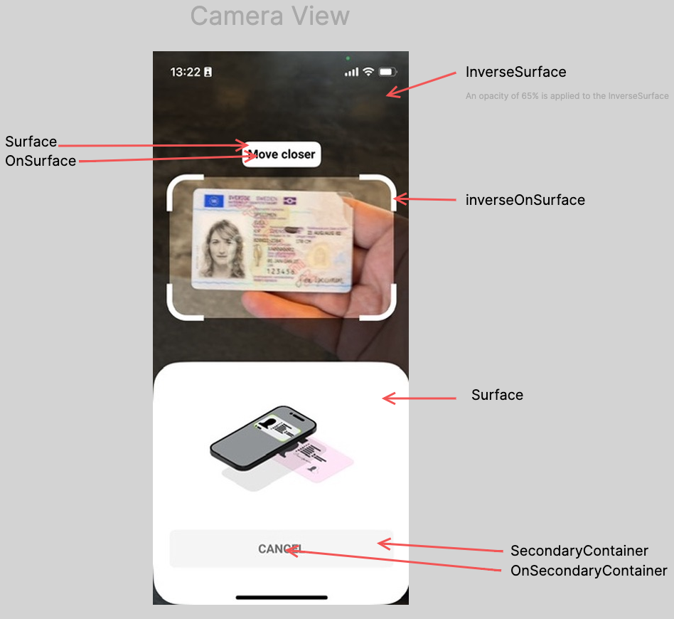
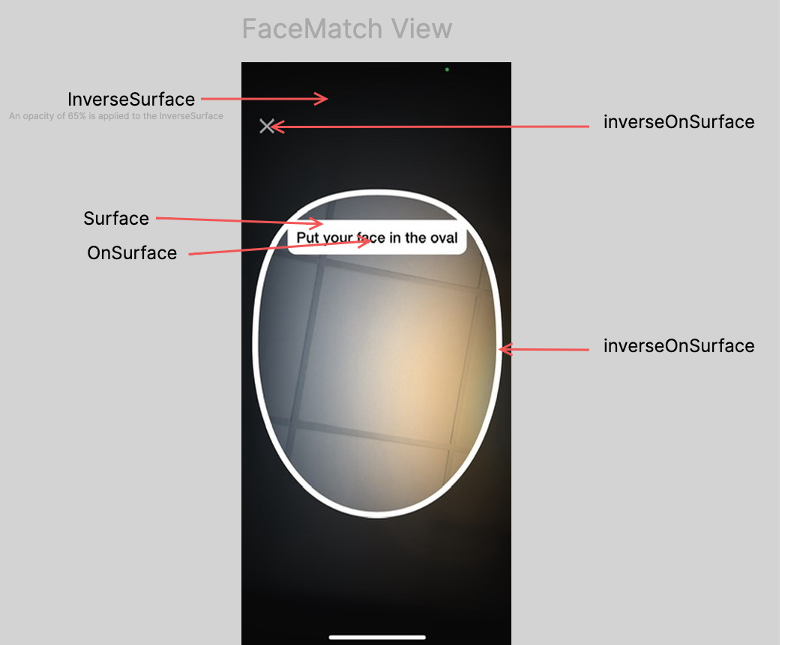
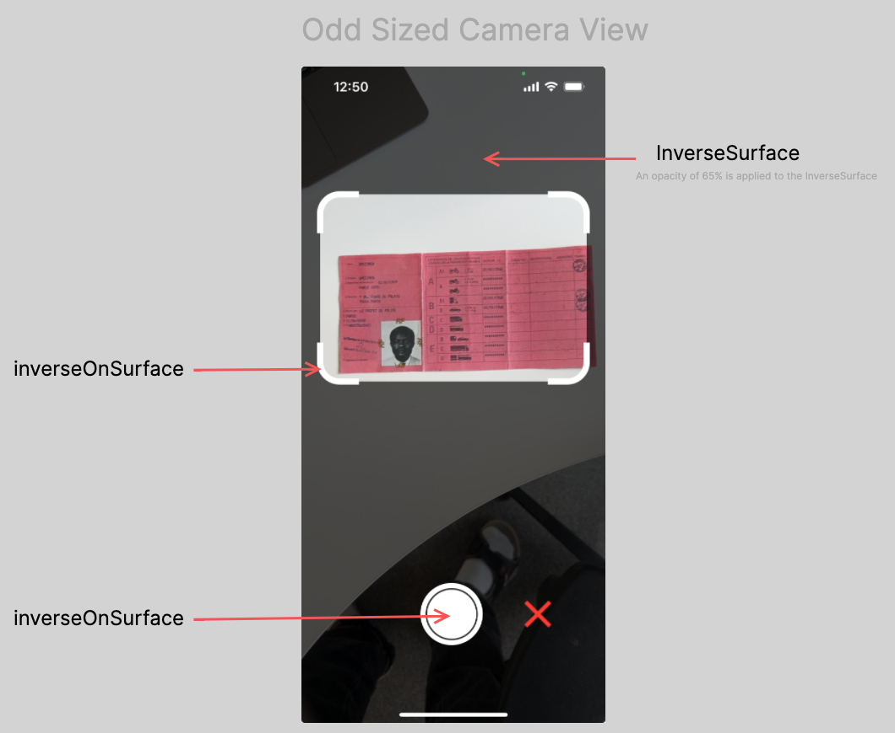
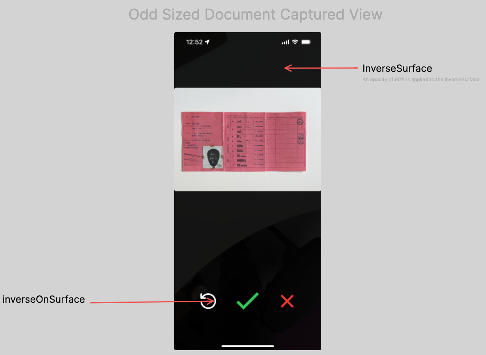

# Custom Theme
 
You can use `IdVerification.setCustomTheme()` to apply a specific set of colors.  
Most of the parameters of this function are optional (except `poweredByLogo`), so you can use only those that suits you. Below you see an example of how you can use this function:

```swift
IdVerification.setCustomTheme(
   IdVerificationTheme(
      primary: UIColor.purple,
      onPrimary: UIColor.white,
      primaryContainer: UIColor.lightPurple,
      secondary: UIColor.gray,
      onSecondary: UIColor.darkgray,
      secondaryContainer: UIColor.lightGray,
      onSecondaryContainer: UIColor.darkGray,
      tertiary: UIColor.purple,
      onTertiary: UIColor.white,
      tertiaryContainer: UIColor.lightPurple,
      onTertiaryContainer: UIColor.white,
      surface: UIColor.white,
      onSurface: UIColor.black,
      onSurfaceVariant: UIColor.darkGray,
      inverseSurface: UIColor.black,
      inverseOnSurface: UIColor.white,
      surfaceContainer: UIColor.lightBlue,

      poweredByLogo: PoweredByLogo = .STANDARD,

      animations: IdVerification.Animations()
    )
)
```

Below you will find images showing which color variables are applied to certain elements in the SDK.

## Information View


## Information Warning Text View


## Camera View



## NFC View


## iProov View



## Wait View


## Odd sized camera view



## Odd sized document captured view



You can use `IdVerification.Animations()` to set custom animations for preparation, loading and instructions.
```swift
IdVerification.Animations(
      public var prepareId3: any SwiftUI.View
      public var prepareId1Frontside: any SwiftUI.View
      public var prepareId1Backside: any SwiftUI.View
      public var prepareDocument: any SwiftUI.View
      public var prepareOddSizedDocument: any SwiftUI.View

      @available(*, deprecated)
      public var prepareNfc: any SwiftUI.View

      public var prepareId1Nfc: any SwiftUI.View
      public var prepareId3Nfc: any SwiftUI.View
      public var prepareDocumentNfc: any SwiftUI.View
      public var prepareFaceMatch: any SwiftUI.View

      public var instructionId3: any SwiftUI.View
      public var instructionId1Frontside: any SwiftUI.View
      public var instructionId1Backside: any SwiftUI.View
      public var instructionOddSizedDocument: any SwiftUI.View
      public var instructionDocument: any SwiftUI.View

      @available(*, deprecated)
      public var instructionNfc: any SwiftUI.View

      public var instructionId1Nfc: any SwiftUI.View
      public var instructionId3Nfc: any SwiftUI.View
      public var instructionDocumentNfc: any SwiftUI.View

      public var loadingImageCapture: any SwiftUI.View
      public var loadingNfc: any SwiftUI.View
      public var loadingFaceMatch: any SwiftUI.View
      public var loadingGeneric: any SwiftUI.View
   )
```

- The prepare animations are shown before the step is to be performed.
- The instruction animations are shown during the step.
- The loading animations are shown after the step is performed.  
- **prepareNfc** animation will override **prepareId1Nfc**, **prepareId3Nfc** and **prepareDocumentNfc**
- **instructionNfc** animation will override **instructionId1Nfc**, **instructionId3Nfc** and **instructionDocumentNfc**

<br/>

Here is an example of how to override the default animations, in this case by replacing a few of them with `ExampleLoadingSpinner()`.  

```swift

// You can use IdVerification.Animations() to set custom animations for preparation, loading and instructions.
let customAnimations = IdVerification.Animations()

// The prepare animations are shown before the step is to be performed.
customAnimations.prepareDocument = ExampleLoadingSpinner()
customAnimations.prepareId3 = ExampleLoadingSpinner()

// The instruction animations are shown during the step.
customAnimations.instructionDocument = CustomAnimation()
customAnimations.instructionId3 = CustomAnimation()

// The loading animations are shown after the step is performed.
customAnimations.loadingNfc = Image("myCustomAnimation")

IdVerification.setCustomTheme(
   IdVerificationTheme(
      primary: UIColor.purple,
      onPrimary: UIColor.white,
      primaryContainer: UIColor.lightPurple,
      secondary: UIColor.gray,
      onSecondary: UIColor.darkgray,
      secondaryContainer: UIColor.lightGray,
      onSecondaryContainer: UIColor.darkGray,
      tertiary: UIColor.purple,
      onTertiary: UIColor.white,
      tertiaryContainer: UIColor.lightPurple,
      onTertiaryContainer: UIColor.white,
      surface: UIColor.white,
      onSurface: UIColor.black,
      onSurfaceVariant: UIColor.darkGray,
      inverseSurface: UIColor.black,
      inverseOnSurface: UIColor.white,

      poweredByLogo: PoweredByLogo = .STANDARD,

      animations: customAnimations
    )
)
```