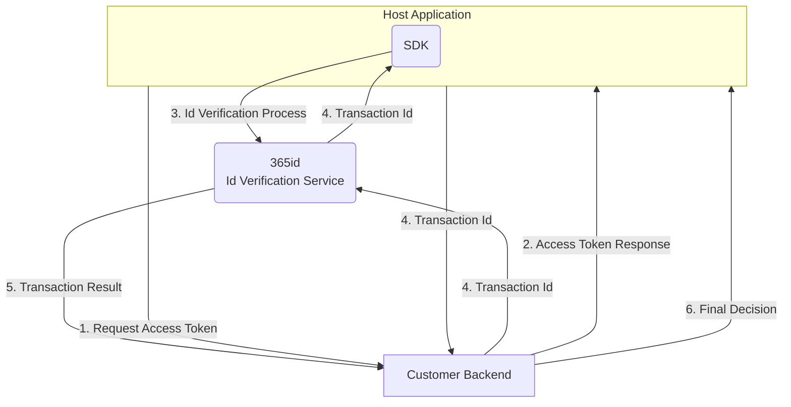
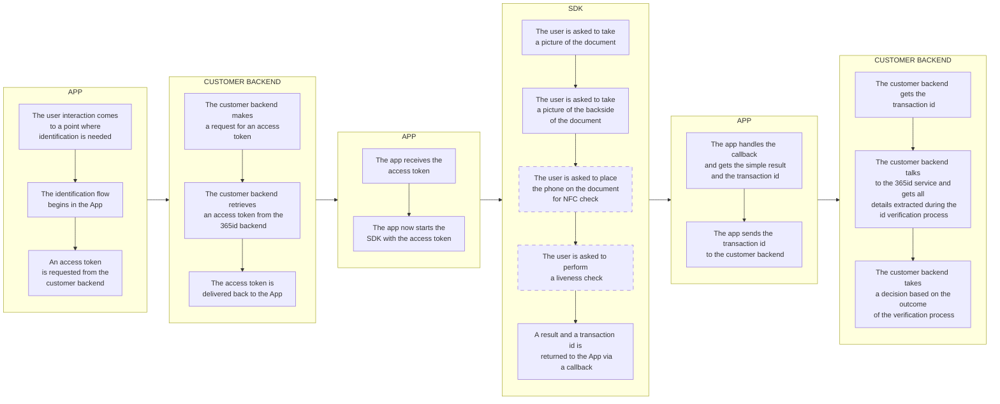
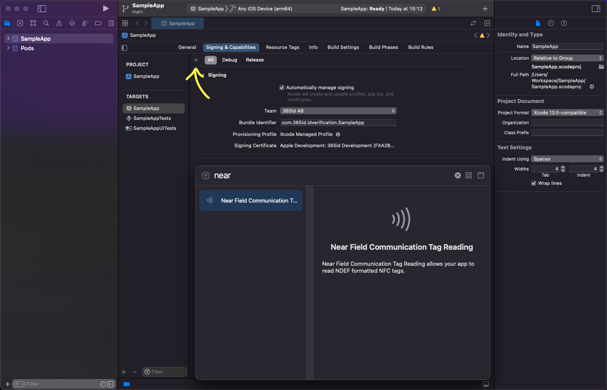
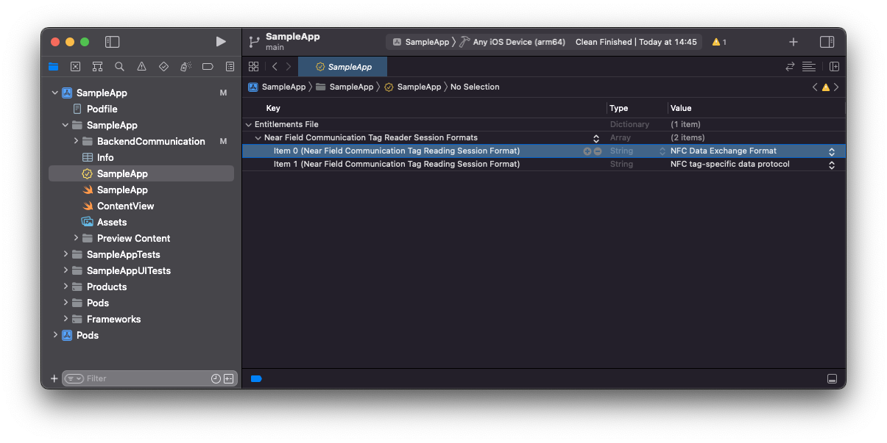
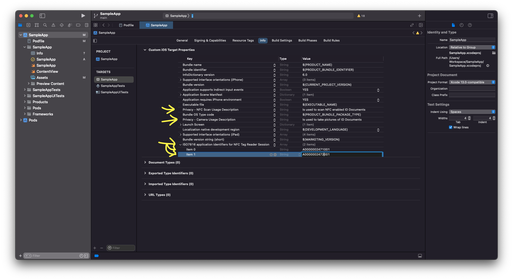
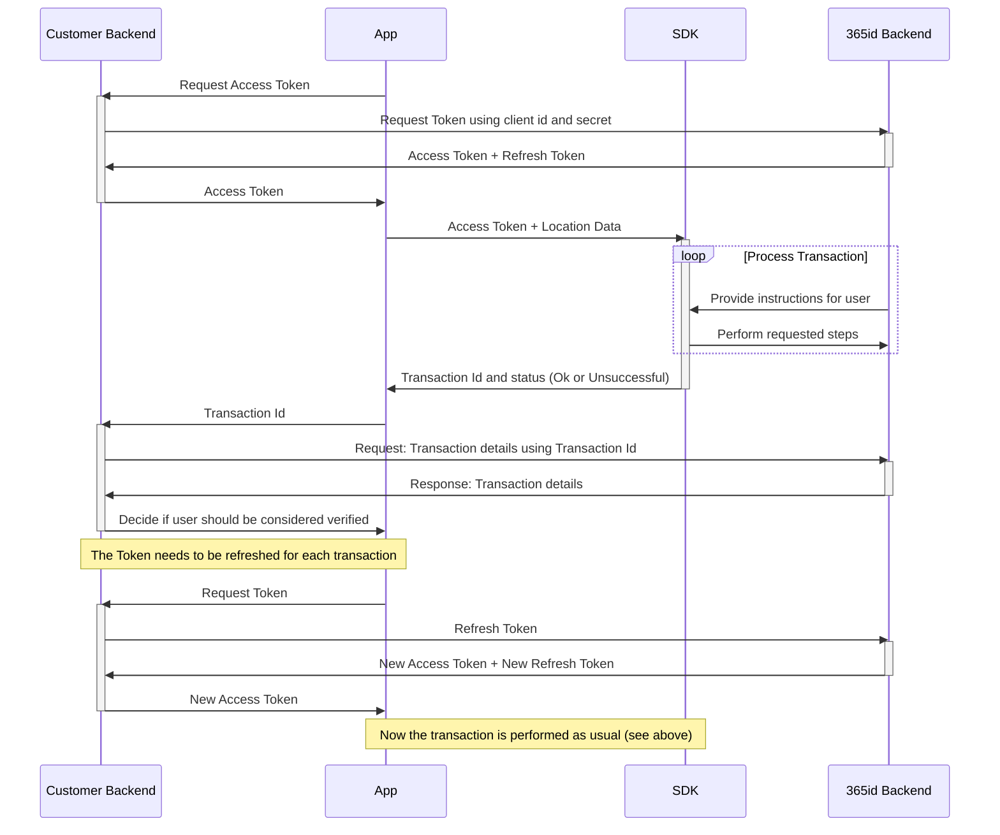

# 365id Id Verification iOS SDK

The 365id Id Verification SDK enables you to integrate 365id services into your iOS app. We also support [Android](https://github.com/365id-AB/idverification-android).  

The SDK supports identifying and validating ID documents such as passports, ID cards and drivers' licenses, as well as reading the text on the document and automatically mapping these to relevant fields when used in conjunction with the [365id Integration Service](https://365id.com/integrations/?lang=en).

<br/>
<br/>
<br/>


## Registration
If you are already a customer of 365id then you can request sdk credentials by contacting 365id's support at [support@365id.com](mailto:support@365id.com).

Otherwise you can contact us at [info@365id.com](mailto:info@365id.com) for further information.

<br/>
<br/>
<br/>

## System integration flow

This is a overview representation how the relationships between the Customer backend, Customer App, SDK and 365id Verification Services looks.



<br/>
<br/>
<br/>

## Application SDK integration flow

This is a basic representation of the flow in an App, integrating the  365id Id Verification SDK together with a Customer backend. Boxes with a dashed outline are configurable steps in the process.



<br/>
<br/>
<br/>

## Requirements
- Xcode 14.0+
- iOS version 14.0 and above
- The framework has been written in Swift 5.3

<br/>
<br/>
<br/>

## Project setup

### Cocoapods

The 365id Id Verification SDK is distributed as a Cocoapod, therefore **you are required to use Cocoapods 1.9.0 or newer** This could change depending on demand for other packaging systems.

1. If you are not yet using Cocoapods in your project, first run `sudo gem install cocoapods` followed by `pod init`. (For further information on installing Cocoapods, [click here](https://guides.cocoapods.org/using/getting-started.html#installation).)

2. Add the following in the top of your Pod file:

   ```ruby
      source 'https://github.com/CocoaPods/Specs.git'
   ```

3. Add the following to your Pod file (inside the target section):

    ```ruby
      pod 'IdVerification365id'
    ```

4. Add the following to the bottom of your Podfile:

   ```ruby
      post_install do |installer|
         installer.pods_project.targets.each do |target|
            if ['iProov', 'Socket.IO-Client-Swift', 'Starscream'].include? target.name
               target.build_configurations.each do |config|
                  config.build_settings['BUILD_LIBRARY_FOR_DISTRIBUTION'] = 'YES'
               end
            end
         end
      end
   ```

5. Run `pod update`.

<br/>
<br/>
<br/>

### Add the NFC capability

The 365id Id Verification SDK uses NFC reading technology to verify the contents of chips present in id documents. In order for this to work, this needs to be added to the integrating application as a capability.

This is how that is done in Xcode 13.4:

1. Set your provisioning profile to support Near Field Communication Tag Reading. You do this on the Apple developer webpage. 

2. Open your project target, on Signing & Capabilities tab, add the Capability of Near Field Communication Tag Reading (By pressing the + button).  



3. Remove the NDEF entitlement.
> **:exclamation: NOTICE:** if the NDEF entitlement is not removed there can be issues when releasing to the AppStore. 



<br/>
<br/>
<br/>  

### Add the target properties

Add a `NSCameraUsageDescription` entry to your app's Info.plist, with the reason why your app requires camera access (e.g. “Allow access to camera to scan ID document.”)  

Add a `NFCReaderUsageDescription` entry to your app's Info.plist, with the reason why your app requires NFC access (e.g. “Allow access to NFC to read the e-passports.”)

Add a `NFC tag type description` to your Info.plist

Example:   ISO7816 application identifiers for NFC Tag Reader Session (A0000002471001 and A0000002472001) 
```xml
   <key>com.apple.developer.nfc.readersession.iso7816.select-identifiers</key>
   <array>
      <string>A0000002471001</string>
      <string>A0000002472001</string>
   </array>
```



<br/>
<br/>
<br/>

### Logging and error handling

The 365id IdVerification SDK uses Sentry for logging and error handling.

Currently Sentry does not have support for running more than one instance at a time, or change the DSN during runtime, therefore, when the SDK starts it performs a check to see if an instance of Sentry is already running, and if that is the case it wont run Sentry.

If your app have an instance of Sentry running, the logs will be sent to your Sentry project. If your app does not use Sentry this wont be an issue.

To avoid getting our logs we suggest that your app exits Sentry just before the SDK starts and reinstantiate your Sentry right after the SDK exits.

<br/>
<br/>
<br/>

### Sample Application

Please note that there is a [Sample Application](/SampleApp/) written in Swift using SwiftUI that demonstrates how the SDK can be used, available in this repository.

<br/>
<br/>
<br/>

## Get started

In order to use the 365id Id Verification SDK it is necessary to follow the steps below.

### Retrieve a token
Before being able to use the 365id Id Verification SDK, you will need an access token and to get that you will need to make a Rest API call with your client id and secret. If you don't have the credentials, please contact us at [info@365id.com](mailto:info@365id.com). Once you have received the credentials you will be able to request an access token. If the access token has expired you don't have to request a new one, all you have to do is refresh it using the refresh_token endpoint.


**Url**: https://eu.customer.365id.com

---
#### **/api/v1/access_token**  
*Used for retrieving a new access token using the client id and secret, also known as customer external id and license key*  

POST  
Request  

*Body - application/json*
```json
{
  "client_id": "string",
  "client_secret": "string"
}
```  
Response
| Code | Description |
| ---- | ----------- |
| 200 | Success |  
  
*Body - application/json*
```json
{
  "access_token": "string",
  "token_type": "string",
  "expires_in": 0,
  "refresh_token": "string",
  "scope": "string"
}
```
| Code | Description |
| ---- | ----------- |
| 400 | Bad Request |  
  
*Body - application/json*
```json
{
  "error": "string",
  "error_description": "string"
}
```
----  

#### **/api/v1/refresh_token**  
*Used for refreshing an already retrieved access token. The access token can be or almost be expired when making this call*

POST  
Request  

*Header*
| Key | Value |
| ----| ----- |
| Authorization | Bearer \<access_token\> |  
  
*Body - application/json*
```json
{
  "refresh_token": "string"
}
```
  
Response  
| Code | Description |
| ---- | ----------- |
| 200 | Success |  
  
*Body - application/json*
```json
{
  "access_token": "string",
  "token_type": "string",
  "expires_in": 0,
  "refresh_token": "string",
  "scope": "string"
}
```

| Code | Description |
| ---- | ----------- |
| 400 | Bad Request |  
  
*Body - application/json*
```json
{
  "error": "string",
  "error_description": "string"
}
```
---  

The access token is valid for a certain amount of time, after that you will have to refresh the access token using the provided refresh token

> **⚠️ SECURITY NOTICE:**  In a production app, it is recommended that you obtain the JWT token using a server-to-server call. The example app retrieves it directly for the sake of simplicity.  

<br/>
<br/>

### Call the SDK

When you in your app have the access token, you are ready to call the `startSDK()` function, supplying the access token as part of the device information required as a parameter. Besides the `device information` you also need to provide a callback function.

### The Callback

An example callback solution can be seen in the Sample App.  
The callback function takes a `TransactionResult` object as its only parameter. The `TransactionResult`contains the transaction id and status of the id verification transaction.  

A callback example taken from the example project for swift
```swift
/**
* Callback
*/
let transactionId = result.transactionId
let status = result.status

switch status {
   case .OK: 
      // This is returned when a transaction completes successfully 
      // Note: This does not mean the user identity or supplied document is verified, 
      // only that the transaction process itself did not end prematurely.
      // The assessment shows a summary 
      let assessment = result.assessment
      print("Verification process completed successfully with status: \(assessment)")

   case .Dismissed:
      // This is returned if the user dismisses the SDK view prematurely.
      print("User dismissed SDK")

   case .ClientException:
      // This is returned if the SDK encountered an internal error. Report such 
      // issues to 365id as bugs!
      print("Client has thrown an exception")

   case .ServerException:
      // This is returned if there was an issue talking to 365id Services. 
      // Could be a connectivity issue.
      print("Server has thrown an exception")

   default:
      // This should not occur
      print("Not supported status type was returned")
}

// Prints the entire result
print("Result: \(result)")

// Stops the SDK and de-allocates the resources
stopSDK()

// Disables the SDK view in example app
self.isShowingSdkView = false

// Dismisses the SDK view
DispatchQueue.main.async {
      presentationMode.wrappedValue.dismiss()
}
```

> **:exclamation: NOTICE:** It is important that you call the `stopSDK()` in the callback, to clear up allocated resources.

> **:exclamation: NOTICE:** In order to return to the host apps view, you will have to dismiss Sdk view.

<br/>

### Launch the SDK View

After starting the SDK by making a call to `startSDK()` and supplying `deviceInfo` which is a string to string dictionary and the callback function. You should switch to the `sdkMainVIew()`.

```swift
// The following entry is required to exist in the dictionary in order to start the SDK
var deviceInfo = [
   // Required. Is received by authenticating with the client_secret and client_id.
   "Token": "<token>"
]

if startSDK(deviceInfo: self.deviceInfo, callback: { result in
   // Handle the result from the transaction
   stopSDK() // The stop function must be called, otherwise resources are not released.
   // The callback is a good place to trigger a dismissal of the SdkMainView() as this is not done by the SDK itself.
}) {
   // Call the SDK main view
   SdkMainView()
}         
```
An example of how the `SdkMainView()` can be used can be seen in the [SampleApp](/SampleApp/SampleApp/ContentView.swift).

<br/>

### Validation of result

To validate the result you will have to use an existing or a new integration with 365id Services. The data returned back contains all the extracted fields along with the captured images and the assessment of the document. The 
captured data is handled in accordance with GDPR and our official [privacy policy](https://365id.com/privacy-policy/).
The data retention time is configurable in our [Customer Portal](https://365id.com/integrations/), though only within the limits of the GDPR.

Documentation for that integration is not covered in this README, it is only delivered on request, so please contact 365id Support at [support@365id.com](mailto:support@365id.com) for your copy.

> **:exclamation: NOTICE:** The example project does not show how to validate the result from the SDK.

<br/>
<br/>

### White Labeling

Before calling `startSDK()` you can customize the SDK´s design with your own colors and logo with `addCustomTheme()`. All parameters of this function are optional, so you can use only those that suits you. Below you see an example of how you can use this function:
```swift
IdVerification.addCustomTheme(WhiteLabeling(
   headerColor: Color.white,
   backgroundColor: Color.gray,
   iconColor: Color.blue,
   appBarLogo: Image("myCustomLogo"),
   scanButtonColor: Color.blue,
   scanButtonTextColor: Color.white,
   containerBoxOuterColor: Color.gray,
   containerBoxInnerColor: Color.white,
   containerBoxTextColor: Color.black,
   containerBoxSubTextColor: Color.black
))
```
<br/>
<br/>
<br/>

## Run the SampleApp project

1. Ensure that you have [Cocoapods installed](https://guides.cocoapods.org/using/getting-started.html#installation) and then run `pod install` from the SampleApp directory to install the required dependencies.

1. Open `SampleApp.xcworkspace`.

1. Add your `client_id` and `client_secret` to [Credentials.swift](/SampleApp/SampleApp/BackendCommunication/Credentials.swift), also add your `Location name` and `Location Id` to [DeviceInformation.swift](/SampleApp/SampleApp/BackendCommunication/DeviceInformation.swift).  
You can obtain these credentials from the [support@365id.com](mailto:support@365id.com). 

4. You should now be able to build and run the project. Please note that you need to run the 365id SDK on a physical device; it will not work in the simulator.

> **⚠️ SECURITY NOTICE:**  The Sample App uses the sdk credentials to directly fetch the access token from the 365id Backend. This is inherently insecure. `This is only done in the purpose of demonstration.` We strongly recommend for a production environment to perform this step with a server-to-server call.

<br/>
<br/>
<br/>

## Production implementation

To implement the SDK inside your app, we recommend an implementation that follows this diagram:



In writing, this can be described as such:

- App requests an access token. This can be handled either by the app directly, or as recommended by the diagram, through your backend services. Requesting the first access token requires a client id and client secret, also known as customer external id and license key. Our recommendation is to store this in your backend, and use it when requesting an access token for the first time. Subsequent access tokens for a specific device can be requested using the existing access token and a refresh token.
- App uses the received access token to start the SDK, beginning a transaction. The SDK will take over the app until all requested steps have been completed, after which it will return a summary of the transaction result, alongside a transaction ID.
- The transaction ID is used to poll 365id services about the details of the transaction. The recommendation here is that your backend receives this ID from the App, then makes a decision based on the result received from the 365id Backend API.


<br/>
<br/>
<br/>

## Help & support

For additional help, please contact support@365id.com.
