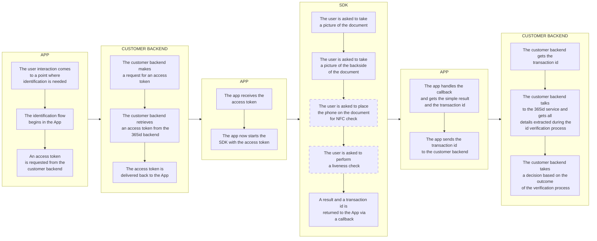
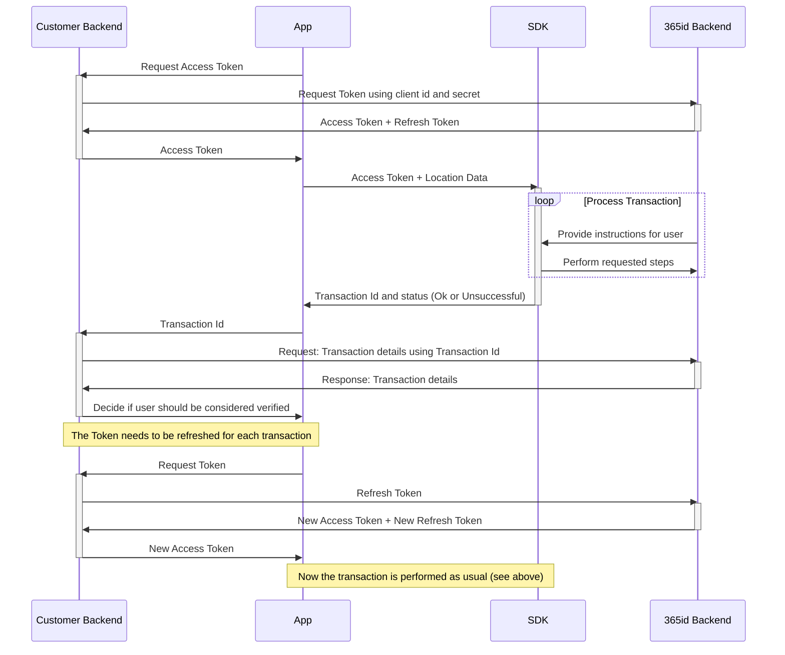

# 365id Id Verification iOS SDK

The 365id Id Verification SDK enables you to integrate 365id services into your iOS app. We also support [Android](https://github.com/365id-AB/idverification-android).

The SDK supports identifying and validating ID documents such as passports, ID cards and drivers' licenses, as well as reading the text on the document and automatically mapping these to relevant fields when used in conjunction with the [365id Integration Service](https://365id.com/integrations/?lang=en).

<br/>
<br/>
<br/>

## Registration

If you are already a customer of 365id then you can request sdk credentials by contacting 365id's support at [support@365id.com](mailto:support@365id.com).

Otherwise you can contact us at [info@365id.com](mailto:info@365id.com) for further information.

<br/>
<br/>
<br/>

## Application SDK integration flow

This is a basic representation of the flow in an App, integrating the 365id Id Verification SDK together with a Customer backend. Boxes with a dashed outline are configurable steps in the process.



<br/>
<br/>
<br/>

## Requirements

- Xcode 15.0+
- iOS version 15.0 and above
- The framework has been written with Swift 5.0 in mind, may work in earlier versions but there is no guarantee.

<br/>
<br/>
<br/>

## Project setup

### Package distribution

#### Swift Package

1. Select `File` → `Add Package Dependencies…` in the Xcode menu bar.

2. Search for the IdVerification SDK package using the following URL:

	```
	https://github.com/365id-AB/idverification-ios
	```

3. Set the _Dependency Rule_ to be _Up to Next Major Version_ and input 2.x.y as the lower bound.

4. Click _Add Package_ to add the Idverification SDK to your Xcode project and then click again to confirm.

#### Installing via Package.swift

If you prefer, you can add IdVerification365id via your Package.swift file as follows:

```swift
.package(
	name: "IdVerification365id",
	url: "https://github.com/365id-AB/idverification-ios",
	.upToNextMajor(from: "2.x.y")
),
```

#### Cocoapods

The 365id Id Verification SDK is distributed as a Cocoapod, therefore **you are required to use Cocoapods 1.15.2 or newer** This could change depending on demand for other packaging systems.

1. If you are not yet using Cocoapods in your project, first run `gem install cocoapods` followed by `pod init`. (For further information on installing Cocoapods, [click here](https://guides.cocoapods.org/using/getting-started.html#installation).)

2. A helpful example of a [Podfile](SampleApp/Podfile) can be found in the SampleApp folder. Copy the complete file or choose sections as needed.

3. Run `pod update`.

<br/>
<br/>
<br/>

### Add the NFC capability

The 365id Id Verification SDK uses NFC reading technology to verify the contents of chips present in id documents. In order for this to work, this needs to be added to the integrating application as a capability.

This is how that is done in Xcode 15.0:

1. Set your provisioning profile to support Near Field Communication Tag Reading. You do this on the Apple developer webpage.

2. Open your project target, on Signing & Capabilities tab, add the Capability of Near Field Communication Tag Reading (By pressing the + button).


3. Remove the NDEF entitlement.
   > **:exclamation: NOTICE:** if the NDEF entitlement is not removed there can be issues when releasing to the AppStore.


<br/>
<br/>
<br/>

### Add the target properties

Add a `NSCameraUsageDescription` entry to your app's Info.plist, with the reason why your app requires camera access (e.g. “Allow access to camera to scan ID document.”)

Add a `NFCReaderUsageDescription` entry to your app's Info.plist, with the reason why your app requires NFC access (e.g. “Allow access to NFC to read the e-passports.”)

Add a `NFC tag type description` to your Info.plist

Example: ISO7816 application identifiers for NFC Tag Reader Session (A0000002471001 and A0000002472001)

```xml
   <key>com.apple.developer.nfc.readersession.iso7816.select-identifiers</key>
   <array>
      <string>A0000002471001</string>
      <string>A0000002472001</string>
   </array>
```


<br/>
<br/>
<br/>

### Sample Application

Please note that there is a [Sample Application](/SampleApp/) written in Swift using SwiftUI that demonstrates how the SDK can be used, available in this repository.

<br/>
<br/>
<br/>

## Get started

In order to use the 365id Id Verification SDK it is necessary to follow the steps below.

### Retrieve a token

Before being able to use the 365id Id Verification SDK, you will need an access token and to get that you will need to make a Rest API call with your client id and secret. If you don't have the credentials, please contact us at [info@365id.com](mailto:info@365id.com). Once you have received the credentials you will be able to request an access token. If the access token has expired you don't have to request a new one, all you have to do is refresh it using the refresh_token endpoint.

**Url**: https://eu.customer.365id.com

---

#### **/api/v1/access_token**

_Used for retrieving a new access token using the client id and secret, also known as customer external id and license key_

POST
Request

_Body - application/json_

```json
{
  "client_id": "string",
  "client_secret": "string"
}
```

Response
| Code | Description |
| ---- | ----------- |
| 200 | Success |

_Body - application/json_

```json
{
  "access_token": "string",
  "token_type": "string",
  "expires_in": 0,
  "refresh_token": "string",
  "scope": "string"
}
```

| Code | Description |
| ---- | ----------- |
| 400  | Bad Request |

_Body - application/json_

```json
{
  "error": "string",
  "error_description": "string"
}
```

---

#### **/api/v1/refresh_token**

_Used for refreshing an already retrieved access token. The access token can be or almost be expired when making this call_

POST
Request

_Header_
| Key | Value |
| ----| ----- |
| Authorization | Bearer \<access_token\> |

_Body - application/json_

```json
{
  "refresh_token": "string"
}
```

Response
| Code | Description |
| ---- | ----------- |
| 200 | Success |

_Body - application/json_

```json
{
  "access_token": "string",
  "token_type": "string",
  "expires_in": 0,
  "refresh_token": "string",
  "scope": "string"
}
```

| Code | Description |
| ---- | ----------- |
| 400  | Bad Request |

_Body - application/json_

```json
{
  "error": "string",
  "error_description": "string"
}
```

---

The access token is valid for a certain amount of time, after that you will have to refresh the access token using the provided refresh token

> **⚠️ SECURITY NOTICE:** In a production app, it is recommended that you obtain the JWT token using a server-to-server call. The example app retrieves it directly for the sake of simplicity.

<br/>
<br/>

### Call the SDK

When you in your app have acquired an access token, you are ready to call the `start(token: String, delegate: IdVerificationEventDelegate)`
function. This function requires you to provide the access token and your own implementation of the `IdVerificationEventDelegate` protocol.

#### Document size type selection

The `documentSizeType`-parameter is an optional parameter to `start()` and with this you will be able to select the document size.
Currently, iOS SDK supports four types of document size that is id1, id3, document and odd.

Selecting a document size type does not force the user to only scan that kind of document but rather encourages the user to scan that type of document by adjusting animations and other UI elements to hint the user to scan that specific type of document.
Here is an example of how to select the document size type:

```swift
IdVerification.start(
   token: myToken,
   documentSizeType: DocumentSizeType.document,
   delegate: myDelegate
)
```

#### Modules To Skip

The `skipModules`-parameter is an optional parameter to `start()` and with this you will be able to skip various identification processes, also known as modules. The input type for this parameter is `IdVerificationSkipModules` which is a class that has a constructor that takes a list of enum values. Here is an example of how to skip two modules:

```swift
IdVerification.start(
   token: myToken,
   skipModules: IdVerificationSkipModules([
      // Define modules to skip here:
      .faceMatch,
      .nfc
   ]),
   delegate: myDelegate
)
```

#### Using the EventDelegate

The protocol `IdVerificationEventDelegate` should be implemented and then a delegate object should be provided with the `start()` function. This gives you detailed feedback on the id verification process and then also the final result of the transaction will only be provided by our backend system, making it safer.

There is an example how the delegate can be implemented and used in the sample app.

```swift
import IdVerification365id

/// Example implementation of the IdVerificationEventDelegate
private class MyEventDelegate: IdVerificationEventDelegate {

   // simplified log function
   private func log(_ msg: String) { Log.info("IdVerification Event: \(msg)") }

   func onStarted() {
      log("The SDK started successfully.")
      showSDKView()
   }

   func onTransactionCreated(_ transactionId: String) {
      log("The SDK created the transaction.")
   }

   func onDocumentFeedback(_ documentType: DocumentType, countryCode: String)
   {
      log("The SDK completed the process of document identification.")
   }

   func onNfcFeedback(_ nfcFeedback: NfcFeedback, expiryDate: String)
   {
      log("The SDK completed the process of reading the nfc chip.")
   }

   func onFaceMatchFeedback(_ facematchFeedback: FaceMatchFeedback)
   {
      log("The SDK completed the process of face match.")
   }

   func onUserDismissed() {
      log("The SDK view was dismissed by the user.")
   }

   func onClosed() {
      log("The Id Verification SDK has now released all its releasable objects.")
      // The SDK is now ready to be started again.
   }

   func onError(_ error: IdVerificationErrorBundle) {
      log("An error has ocurred during the verification process.")
      hideSDKView()
   }

   func onCompleted(_ result: IdVerificationResult) {
      log("The id verification process has completed.")
      hideSDKView()
   }
}
```

> **:exclamation: NOTICE:** It is important that you call the `IdVerification.stop()` function, to clear up allocated resources.

> **:exclamation: NOTICE:** In order to return to the host apps view, you will have to dismiss the Sdk view.

<br/>

### Launch the SDK View

After starting the SDK by making a call to `IdVerification.start()` and gotten a `true` response. You should switch to the `sdkMainView()`.

An example of how the `SdkMainView()` can be used can be seen in the [SampleApp](/SampleApp/SampleApp-Swift/ContentView.swift).

<br/>

### Validation of result

To validate the result you will have to use an existing or a new integration with 365id Services. The data returned back contains all the extracted fields along with the captured images and the assessment of the document. The
captured data is handled in accordance with GDPR and our official [privacy policy](https://365id.com/privacy-policy/).
The data retention time is configurable in our [Customer Portal](https://365id.com/integrations/), though only within the limits of the GDPR.

Documentation for that integration is not covered in this README, it is only delivered on request, so please contact 365id Support at [support@365id.com](mailto:support@365id.com) for your copy.

> **:exclamation: NOTICE:** The example project does not show how to validate the result from the SDK.

<br/>
<br/>

## Custom Theme

Before calling `Idverification.start()` you can customize the SDK colors, logo and animations by using the function `IdVerification.setCustomTheme()`. 

You can replace the animations with your own custom animations or static images. 

For more information on how to do this, check out the [custom theme documentation](README.THEME.md)
<br/>
<br/>

## Log and Telemetry collection

The 365id IdVerification SDK uses [Sentry](https://sentry.io/) for collecting logs and telemetry data.

### What data are we collecting

We are not, during any stage, collecting the users PII (Personal Identifiable Information). That includes, but are not limited to; email addresses, user names, phone number etc.

#### Logging

For logging we are collecting the following data to help us find and fix problems in our SDK:

- SDK version
- Stacktraces

#### Telemetry

The telemetry data we collect to find bottlenecks and slow processes in our SDK is:

- The time different requests are taking to execute.
- The time a user spend on each view.

### If your app uses Sentry

Currently Sentry does not have support for running more than one instance at a time, or change the DSN during runtime, therefore, when the SDK starts it performs a check to see if an instance of Sentry is already running, and if that is the case it wont run Sentry.

If your app have an instance of Sentry running, the logs will be sent to your Sentry project. If your app does not use Sentry this wont be an issue.

To avoid getting our logs we suggest that your app exits Sentry just before calling `IdVerification.start()` and re-instantiate your Sentry right after the `OnClose` callback is triggered.

<br/>
<br/>
<br/>

## Run the SampleApp project

1. Ensure that you have [Cocoapods installed](https://guides.cocoapods.org/using/getting-started.html#installation) and then run `pod install` from the SampleApp directory to install the required dependencies.

1. Open `SampleApp.xcworkspace`.

1. Add your `client_id` and `client_secret` to [Credentials.swift](/SampleApp/SampleApp/BackendCommunication/Credentials.swift), also add your `Location name` and `Location Id` to [DeviceInformation.swift](/SampleApp/SampleApp/BackendCommunication/DeviceInformation.swift).
   You can obtain these credentials from the [support@365id.com](mailto:support@365id.com).

1. You should now be able to build and run the project. Please note that you need to run the 365id SDK on a physical device; it will not work in the simulator.

> **⚠️ SECURITY NOTICE:** The Sample App uses the sdk credentials to directly fetch the access token from the 365id Backend. This is inherently insecure. `This is only done in the purpose of demonstration.` We strongly recommend for a production environment to perform this step with a server-to-server call.

<br/>
<br/>
<br/>

## Production implementation

To implement the SDK inside your app, we recommend an implementation that follows this diagram:



In writing, this can be described as such:

- App requests an access token. This can be handled either by the app directly, or as recommended by the diagram, through your backend services. Requesting the first access token requires a client id and client secret, also known as customer external id and license key. Our recommendation is to store this in your backend, and use it when requesting an access token for the first time. Subsequent access tokens for a specific device can be requested using the existing access token and a refresh token.
- App uses the received access token to start the SDK, beginning a transaction. The SDK will take over the app until all requested steps have been completed, after which it will return a summary of the transaction result, alongside a transaction ID.
- The transaction ID is used to poll 365id services about the details of the transaction. The recommendation here is that your backend receives this ID from the App, then makes a decision based on the result received from the 365id Backend API.

<br/>
<br/>
<br/>

## API

You can find full API documentation here: [https://365id-ab.github.io/idverification-ios/documentation/idverification365id/](https://365id-ab.github.io/idverification-ios/documentation/idverification365id/)

### local access to API documentation

If you would like to access the documentation locally you can run the command `sh show_api.sh`

## Help & support

For additional help, please contact support@365id.com.
