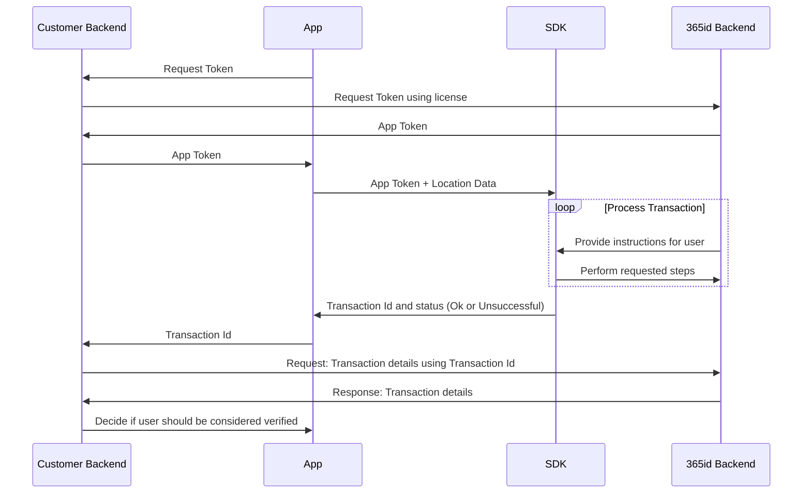

# 365id Id Verification iOS SDK v0.2.13

## Table of contents
 - [Introduction](#introduction)
 - [Requirements](#requirements)
 - [Registration](#registration)
 - [Installation](#installation)
 - [Get started](#get-started)
 - [Sample project](#sample-project)
 - [Production](#production)
 - [Help & support](#help--support)


<br/>
<br/>
<br/>

## Introduction

The 365id Id Verification SDK enables you to integrate 365id services into your iOS app. We also support [Android](https://github.com/365id-AB/idverification-android).  

The SDK supports identifying and validating ID documents such as passports, ID cards and drivers' licenses, as well as reading the text on the document and automatically mapping these to relevant fields when used in conjunction with [365id Integration Service](https://365id.com/integrations/?lang=en).

<br/>
<br/>
<br/>


## Requirements
- Xcode 13.3 and above
- iOS version 14.0 and above
- The framework has been written in Swift 5.0

<br/>
<br/>
<br/>

## Registration
If you are already a customer of 365id then you can request a license key by contacting 365id's support at [support@365id.com](mailto:support@365id.com).

Otherwise you can contact us at [info@365id.com](mailto:info@365id.com) for further information.

When you receive your license key you will also receive a location id to pass to the SDK.

<br/>
<br/>
<br/>

## Installation
### Cocoapods

The 365id Id Verification SDK is distributed as an XCFramework, therefore **you are required to use Cocoapods 1.9.0 or newer**.

1. If you are not yet using Cocoapods in your project, first run `sudo gem install cocoapods` followed by `pod init`. (For further information on installing Cocoapods, [click here](https://guides.cocoapods.org/using/getting-started.html#installation).)

2. Add the following to your Pod file (inside the target section):

    ```ruby
      pod 'iProov'
      pod 'IdVerification365id', '0.2.17'
    ```

3. Add the following to the bottom of your Podfile:

	```ruby
	post_install do |installer|
	  installer.pods_project.targets.each do |target|
	    if ['iProov', 'Socket.IO-Client-Swift', 'Starscream'].include? target.name
	      target.build_configurations.each do |config|
	          config.build_settings['BUILD_LIBRARY_FOR_DISTRIBUTION'] = 'YES'
	      end
	    end
	  end
	end
	```

4. Run `pod install`.

<br/>

### Dependencies - Swift Package Manager

> **:exclamation: NOTICE:** 365id Id Verification SDK is dependent on [gRPC-Swift and SwiftProtobuf](https://github.com/grpc/grpc-swift.git). This dependency should be included via Swift Package Manager.

<br/>

### Add an `NSCameraUsageDescription`

Add an `NSCameraUsageDescription` entry to your app's Info.plist, with the reason why your app requires camera access (e.g. “Allow access to camera to scan ID document.”)

<br/>

### Add an `NFCReaderUsageDescription`

1. Set your provisioning profile to support for Near Field Communication Tag Reading.  
   Open your project target, on Signing & Capabilities tab, add the Capability of Near Field Communication Tag Reading (By pressing the + button).
2. Add an `NFCReaderUsageDescription` entry to your app's Info.plist, with the reason why your app requires NFC access (e.g. “Allow access to NFC to read the e-passports.”)
3. Add NFC tag type descriptions to your Info.plist
   Example:   ISO7816 application identifiers for NFC Tag Reader Session (A0000002471001 and A0000002472001) 
     ```xml
   <key>com.apple.developer.nfc.readersession.iso7816.select-identifiers</key>
   <array>
      <string>A0000002471001</string>
      <string>A0000002472001</string>
   </array>
   ```


<br/>
<br/>
<br/>


## Get started
In order to use the 365id Id Verification SDK it is necessary to follow these steps

### Retrieve a token

Before being able to use the 365id Id Verification SDK, you will need a JWT token. The way of doing that is to make gRPC call using the [Authentication.proto](./Example/Example/Grpc/Protos/Authentication.proto) file to the url `https://frontend-device-ag.int.365id.com:5001`.  

1. `AuthenticateRequest` - Requests a JWT token based on a provided license key, Language Code and a Vendor Id.
2. `RefreshTokenRequest` - Requests a refreshed token using the refresh token.

The JWT token is valid for 3 minutes, after that you will have to refresh the token using the provided refresh token. In the [ExampleApp.swift](./Example/Example/ExampleApp.swift) file you can find how the example app retrieves its token using the license key.

> **⚠️ SECURITY NOTICE:**  In a production app, it is recommended that you obtain the JWT token using a server-to-server call. The example app retrieves it directly for the sake of simplicity.

<br/>

### Callback

Register a callback function. The callback function receives a `TransactionResult` object containing the transaction id and status.  

A callback example taken from the example project for swift
```swift
/**
* Callback
*/
let transactionId = result.transactionId
let status = result.status

switch status {
   case .OK: 
      // This is returned when a transaction completes successfully 
      // Note: This does not mean the user identity or supplied document is verified, 
      // only that the transaction process itself did not end prematurely.
      // The assessment shows a summary 
      let assessment = result.assessment
      print("Successful result")

   case .Dismissed:
      // This is returned if the user dismisses the SDK view prematurely.
      print("User dismissed SDK")

   case .ClientException:
      // This is returned if the SDK encountered an internal error. Report such 
      // issues to 365id as bugs!
      print("Client has thrown an exception")

   case .ServerException:
      // This is returned if there was an issue talking to 365id Services. 
      // Could be a connectivity issue.
      print("Server has thrown an exception")

   default:
      // This should not occur
      print("Not supported status type was returned")
}

// Prints the entire result
print("Result: \(result)")

// Stops the SDK and de-allocates the resources
stopSDK()

// Disables the SDK view in example app
self.isShowingSdkView = false

// Dismisses the SDK view
DispatchQueue.main.async {
      presentationMode.wrappedValue.dismiss()
}
```

> **:exclamation: NOTICE:** It is important that you call the `stopSDK()` in the callback, to clear up allocated resources.

> **:exclamation: NOTICE:** In order to return to the host apps view, you will have to dismiss Sdk view.

<br/>

### Launch the SDK

Start the SDK in the app by making a call to `startSDK()` and supplying `deviceInfo` which is a string to string dictionary and a callback function.

Upon a successful start of the SDK, switch to the SDK View.

```swift
// The following three entries are required to exist in the dictionary in order to start the SDK
@State var deviceInfo = [
   // The entry is required but the value is optional. Can be set to empty string.
   "LocationName": "<the location name>",
   // Required. Id is received from 365id along with license key
   "LocationId": "<the location id>",
   // Required. Is received by authenticating with the license key
   "Token": "<token>"
]

if startSDK(deviceInfo: self.deviceInfo, callback: {
   // Callback
}) {
   // Call the SDK main view
   SdkMainView()
}         
```
Once the SDK has been started, all you have to do is switch to the SDK view `SdkMainView()`, see example in [ExampleApp](./Example/Example/ExampleApp.swift) and [ContentView](./Example/Example/ContentView.swift).

<br/>

### Validation of result
To validate the result you will have to use an existing or a new integration to 365id Services. The data returned back contains all the extracted fields along with the captured images and the assessment of the document.

Documentation for that integration is not covered here and is only delivered on request, so please contact 365id Support at [support@365id.com](mailto:support@365id.com) for your copy.

> **:exclamation: NOTICE:** The example project does not show how to validate the result from the SDK.

<br/>
<br/>
<br/>

## Sample project

1. Ensure that you have [Cocoapods installed](https://guides.cocoapods.org/using/getting-started.html#installation) and then run `pod install` from the Example directory to install the required dependencies.

2. Rename `Credentials.example.swift` to `Credentials.swift` and update it with your licenseKey, Location name and Location Id. You can obtain these credentials from the [support@365id.com](mailto:support@365id.com).

3. Open `Example.xcworkspace`.

4. You can now build and run the project. Please note that you can run the 365id SDK on a real device; it will not work in the simulator.

> **⚠️ SECURITY NOTICE:**  The example app uses the license key to directly fetch tokens from the 365id Backend. This is inherently insecure. We strongly recommend for a production environment to perform this step with a server-to-server call.

<br/>
<br/>
<br/>

## Production

To implement the SDK inside your app, we recommend an implementation that follows this diagram:



In writing, this can be described as such:

- App requests a token. This can be handled either by the app directly, or as recommended by the diagram, through your backend services. Requesting the first token requires a license key. Our recommendation is to store this in your backend, and use it when requesting an app token for the first time. Subsequent tokens for a specific device can be requested using the existing token and a refresh token.
- App uses the received token to start the SDK, beginning a transaction. The SDK will take over the app until all requested steps have been completed, after which it'll return a summary of the transaction result, alongside a transaction ID.
- The transaction ID is used to poll 365id services about the details of the transaction. Recommendation here is that your backend receives this ID from the App, then makes a decision based on the result received from the 365id Backend API.

<br/>
<br/>
<br/>

## Help & support

For additional help, please contact support@365id.com.